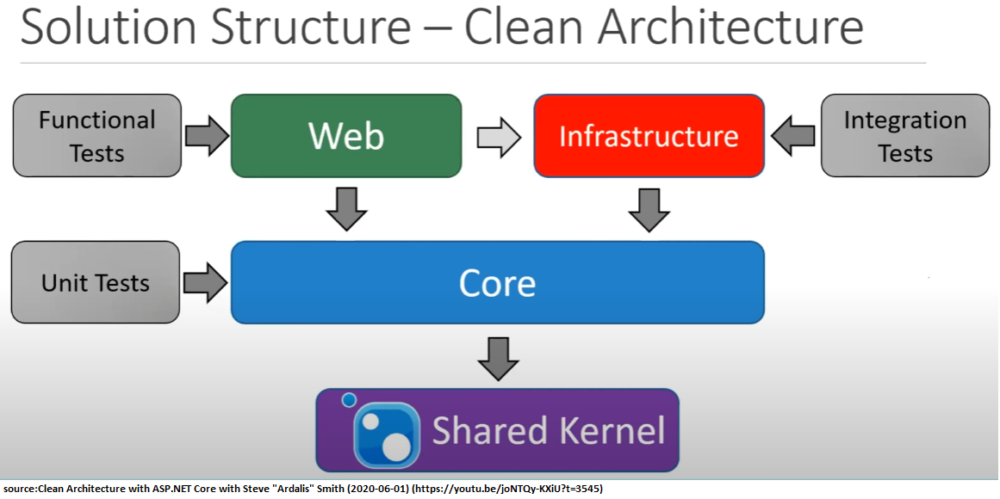

# Clean Architecture
## Layers
- Domain: Enterprise wide-logic and types
  - Interfaces
  - Entities, Value Objects and Aggregate
  - Enumerations
  - Logic
  - Exceptions
  - Services
  - Specifications(for Query operations)

- Application: Application specific business logic and types
  - Interfaces to be implemented by outer layers (i.e. Infrastructure, Persistence)
  - Models or (View Models) - Requires mapping
  - Commands / Queries
  - Validation
  - Exception

- Infrastructure: All external concerns (things not in your memory space or third parties). No layer depend on this layer.
  - Depends on Application layer only
  - The following concerns are implemented in this layer:
    - Persistence
    - Logging & Tracing
    - Notification
    - Caching
    - Identity
    - Security
    - Inversion of control
    - Networking
    - File Access
    - API Clients
    - System Clock

- Presentation Layer:
  - UI
  - Web API
    - Controllers
    - Models
  - Web App: Imho, this should be dependent on the Web API. It should not be bundled with the Web API.

- Shared Kernel (Common): Common types shared by multiple different domains/applications/bounded contexts throughout the enterprise.
  - Base Entity, Base Domain Event ,Base Specification
  - Common Exceptions and Interfaces
  - Common Auth (i.e. User Class), Common DI (i.e. extension methods), Common logging and common guard clauses.

## Various styles of clean architecture
The Clean Architecture is defined in different forms by various experts. All of them have only one purpose to do so: `Separation of Concerns`. 

The most common and known ones are as follow:
### Traditional (Three-Tier) Architecture

  

### [Hexagonal Architecture by Alistair Cockburn](https://alistair.cockburn.us/Hexagonal+architecture)

  

  

Hexagonal architecture is also known known as `Ports/Adapters`. Check this [link](https://www.dossier-andreas.net/software_architecture/ports_and_adapters.html) for details. 

### [Onion Architecture by Jeffrey Palermo](https://jeffreypalermo.com/2008/07/the-onion-architecture-part-1/)

  

  

  

### [Clean Architecture by Uncle Bob](https://blog.cleancoder.com/uncle-bob/2012/08/13/the-clean-architecture.html)

  

### [Clean Architecture by Steve Smith](https://youtu.be/joNTQy-KXiU?t=3545)

  

## Guidelines - Best Practices
- Consider using OwnedEntity feature of EF Core when a value object is wrapped/part of an owner entity.

### Steve Smith
- He prefers representing features within aggregates with the help of domain events. Defines dedicated features folder in the ui layer.

- Infrastructure layer:
  - Fire events after you are done with db related operations. Save/update/delete the state first and then fire domain events.
- Web API:
  - Controller Action (or page Handlers for UI):
    1. Accept task-specific types(ViewModel, ApiModel, BindingModel)
    2. Perform and handle model validation (ideally w/filters)
    3. <Do Work>
    4. Create any model type required for the response
    5. Return an appropriate Result Type (View, Page, OK, NotFound etc.)
  - What is `Do Work`? You have different ways to handle:
    1. Repositories and Entities (This works well with the CRUD type models and simple operations)
        - Get Entity from the injected repo
        - Work on that and its methods
        - Map it accordingly
        - Update the entity's state using the repo.
    2. Work with an `application service`.
        - Pass ApiModel types to the service
        - Application service internally works with the repositories and domain model types
        - Service returns a web model type.
        - Application service is responsible for mapping between models.
        - Keep controllers ligthweight and with fewer injected dependencies.
    3. Use CQRS like approach with tools like `MediatR`.
        - Use ApiModel types that represent commands. (Use Case)
        - Send model-bound instance of command to handler using `_mediator.Send();`.
        - No need to inject seperate services to different controllers.
        - You can resolve commands using `Model Binding`.
        - Try to place `command handlers` as close to Core as you can.
  - Define `ApiEndpoint` for each action to break up the controller in a more concise way.
- Web(Presentation):
  - In order Web to wire things up, it need Infrastructure layer. This can be achieved in two ways:
    1. Referencing the Infrastructure from Web(or Presentation) layer. (Not really wanted???)
    2. Use reflection. (Make sure Infrastructure assemblies go to the output bin and Web can consume them. Dependency Injection in ASP.NET Core supports Reflection.)
- Shared Kernel (Common):
  - Prefer distributing this layer through packaging. 

### Jason Taylor
- Domain Layer: 
  - Avoid using data annotations
  - Use Value objects where appropriate
  - Initialize all collections and use private setters.
  - Consider using [AuditableEntity](https://youtu.be/dK4Yb6-LxAk?t=885)
- Application Layer:
  - [Using CQRS and MediatR together brings great power](https://youtu.be/dK4Yb6-LxAk?t=1027)
  - Use `AutoMapper` for mapping
  - Provide an extension method for dependency injection to be consumed by upper layer using `Microsoft.Extensions.DependencyInjection`.
  - MEdiatR simplifies cross cutting concerns.(?)
- Infrastructure Layer:
  - EF Core configurations are handled in this layer.[Youtube](https://youtu.be/dK4Yb6-LxAk?t=2165)
  - Provide an extension implementation to be used by dependency injection(https://youtu.be/dK4Yb6-LxAk?t=2373).

## Open Source Projects
- [https://github.com/ardalis/CleanArchitecture](https://github.com/ardalis/CleanArchitecture)
- [https://github.com/matthewrenze/clean-architecture-demo](https://github.com/matthewrenze/clean-architecture-demo)

## Other References
- [Layers, Onions, Ports, Adapters: it's all the same by Mark Seemann](https://blog.ploeh.dk/2013/12/03/layers-onions-ports-adapters-its-all-the-same/)

- [Gerg Young](https://goodenoughsoftware.net)
- [Udi Dahan](http://udidahan.com)
- [Vaugh Vernon](vaughvernon.com)